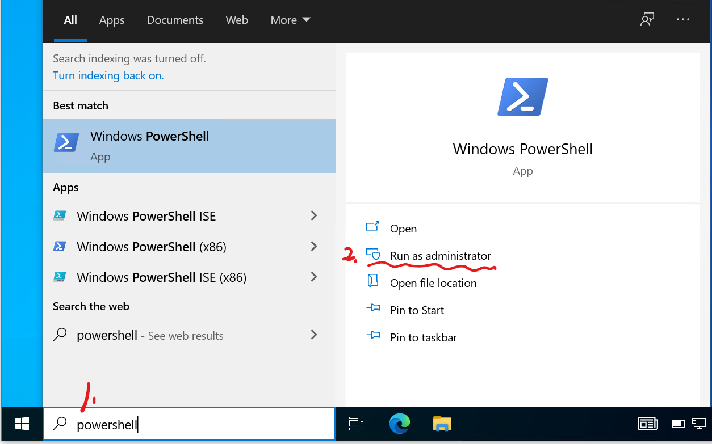
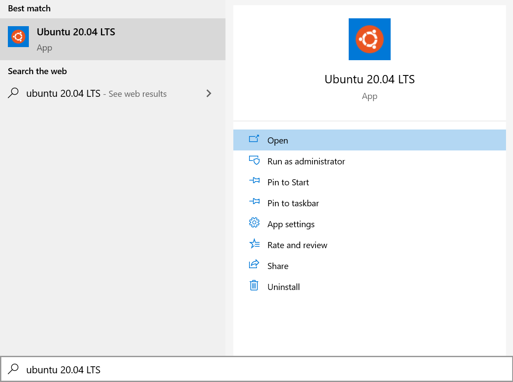
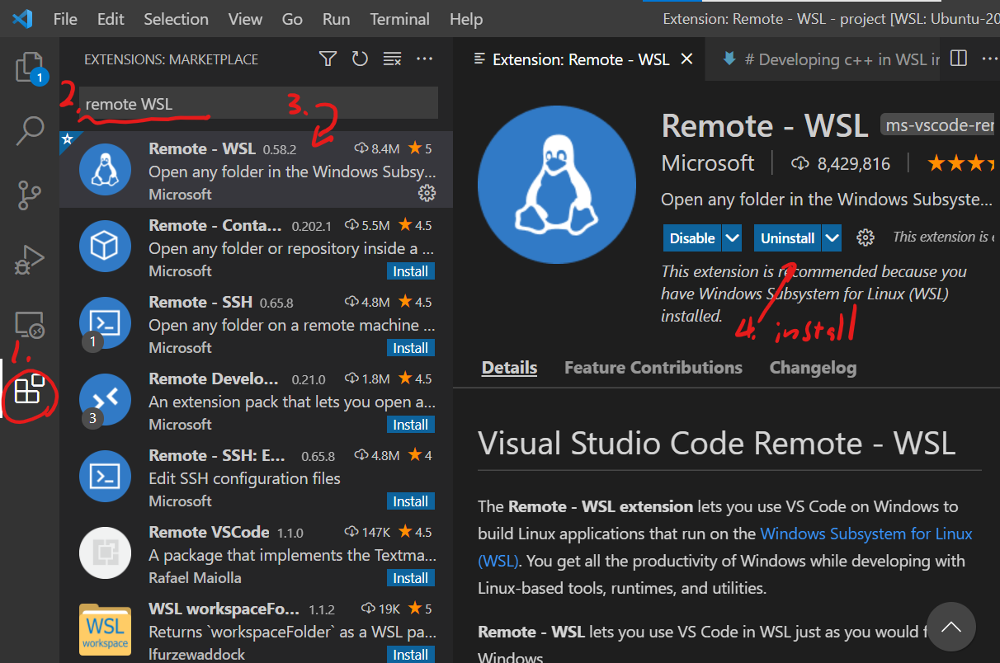
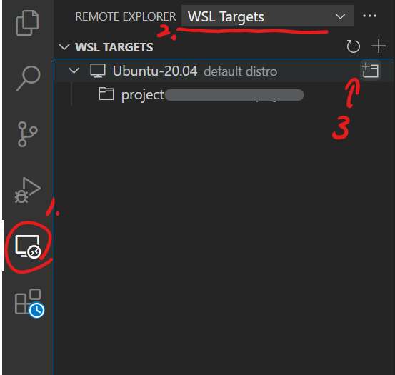

# Developing c++ in WSL in Windows 10

## Install WSL2 in Windows 10
* install WSL with a single command in Windows 10 version 2004 or higher [[1]](https://docs.microsoft.com/en-us/windows/wsl/install) [[2]](https://devblogs.microsoft.com/commandline/install-wsl-with-a-single-command-now-available-in-windows-10-version-2004-and-higher/)
1. open PowerShell as Administrator:

2. run command `wsl --install`
```sh
C:\Users\WDAGUtilityAccount> wsl --install
```
3. restart machine

* install WSL manually [[3]](https://docs.microsoft.com/en-us/windows/wsl/install-manual)
1. Open PowerShell as Administrator:
2. run command `dism.exe /online /enable-feature /featurename:Microsoft-Windows-Subsystem-Linux /all /norestart`
```sh
C:\Users\WDAGUtilityAccount> dism.exe /online /enable-feature /featurename:Microsoft-Windows-Subsystem-Linux /all /norestart
```
3. run command `dism.exe /online /enable-feature /featurename:VirtualMachinePlatform /all /norestart`
```sh
C:\Users\WDAGUtilityAccount> dism.exe /online /enable-feature /featurename:VirtualMachinePlatform /all /norestart
```
4. restart machine
5. download and install package from this [link](https://docs.microsoft.com/en-us/windows/wsl/install-manual)

# Set WSL 2 as your default version
1. Open PowerShell as Administrator
2. run command `wsl --set-default-version 2`
```sh
C:\Users\WDAGUtilityAccount> wsl --set-default-version 2
```

# Install your Linux distribution of choice
* [reference1](https://docs.microsoft.com/en-us/windows/wsl/install-manual#step-6---install-your-linux-distribution-of-choice)
* [reference2](https://docs.microsoft.com/en-us/windows/wsl/install#change-the-default-linux-distribution-installed)

# Create a user account and password
* [referece](https://docs.microsoft.com/en-us/windows/wsl/setup/environment#set-up-your-linux-user-info)

# Install compiler and packages
1. open WSL terminal

2. run the following commands
```bash
# install utils
sudo apt update 
sudo apt install -y wget curl

# install g++
DEBIAN_FRONTEND=noninteractive sudo apt install -y build-essential g++ gdb
g++ -v
```

# Install extension `Remote WSL`
1. open vscode
2. search and install extension `Remote WSL`


# Open vscode in WSL
