# 安裝步驟

1. 下載[vscode-all-in-one.zip](https://github.com/CNOCycle/cpp_tutorial/releases/download/win-mingw-vscode/vscode-all-in-one.zip)
2. 解壓縮縮後，將檔案放到路徑`%USERPROFILE%`
3. 將`%USERPROFILE%\mingw-w64\x86_64-8.1.0-posix-seh-rt_v6-rev0\mingw64\bin`加入到環境變數`Path`
4. 完成

# 圖解說明

* `%USERPROFILE%` 是windows的環境變數，指的是該電腦使用者的目錄。概念同linux底下的`${HOME}`。以本台測試電腦為例，該電腦使用者為`WDAGUtilityAccount`，則`%USERPROFILE%`=`C:\Users\WDAGUtilityAccount`。正常請況下在檔案總管上的路徑列輸入`%USERPROFILE%`後會自動跳轉。如下圖示範：
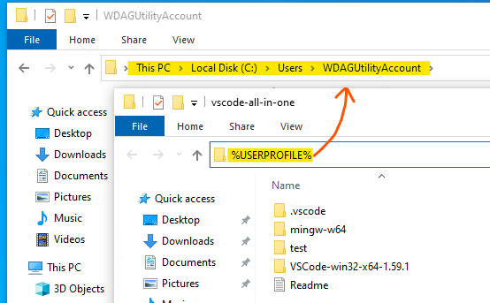

* 將檔案放到路徑`%USERPROFILE%`，如下圖示範：
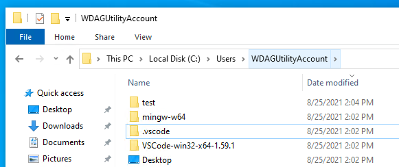

* 將`%USERPROFILE%\mingw-w64\x86_64-8.1.0-posix-seh-rt_v6-rev0\mingw64\bin`加入到環境變數`Path`，如下圖示範：
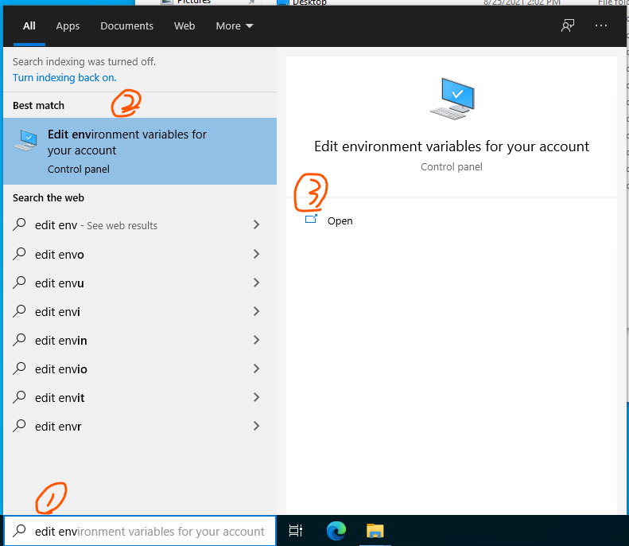
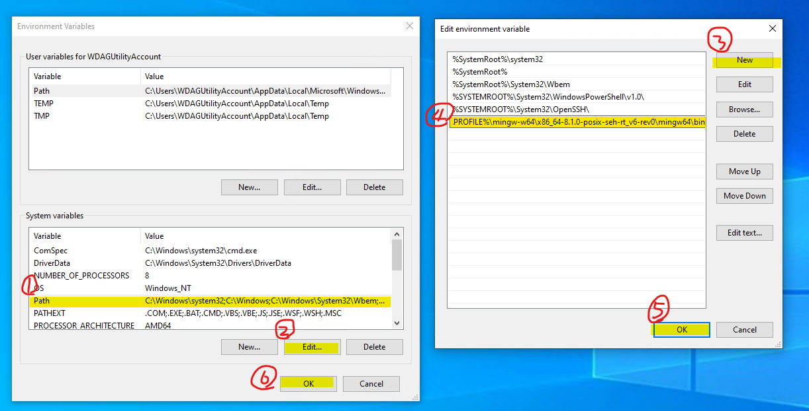

# 測試編譯以及除錯

## 測試編譯
1. 用`vscode`編輯器選擇開啟解壓縮檔案裡面的`test`資料夾，如下圖示範：
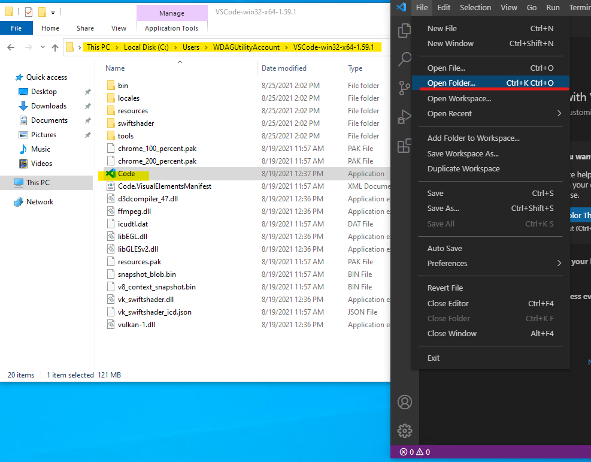
2. 信任開啟檔案，選擇`Yes, I trust`，如下圖示範：
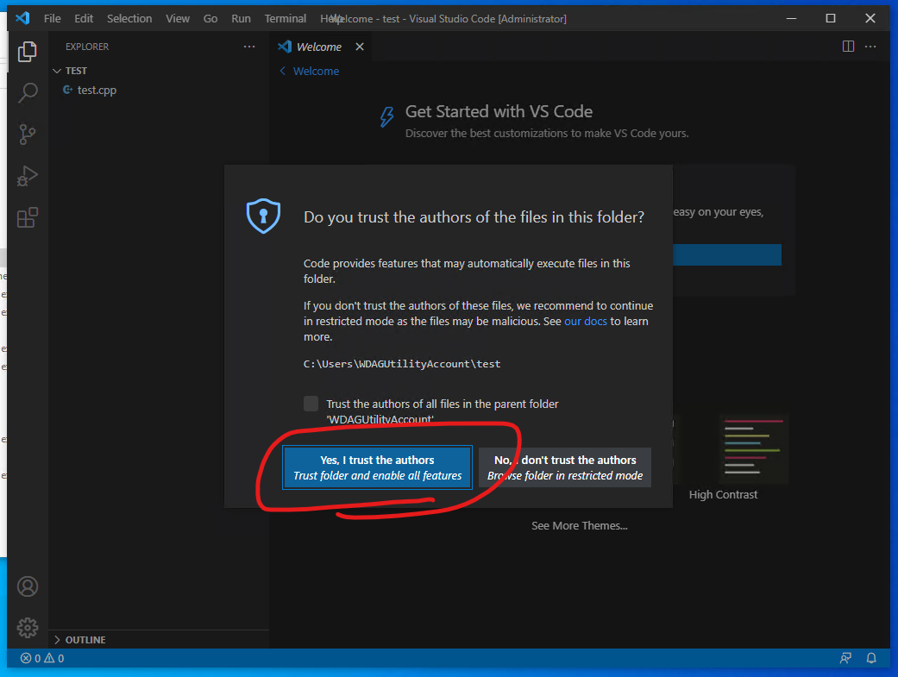
3. 點擊左方test.cpp檔案後，在第5行左側按下去，會出現紅點，如下圖示範：
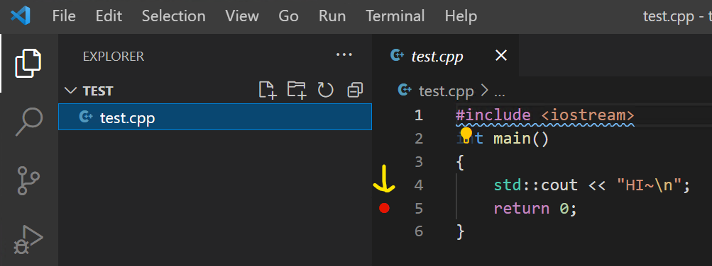
4. 按下`ctrl+shift+B`按鍵，或上方`terminal -> Run Build Task`，如下圖示範：
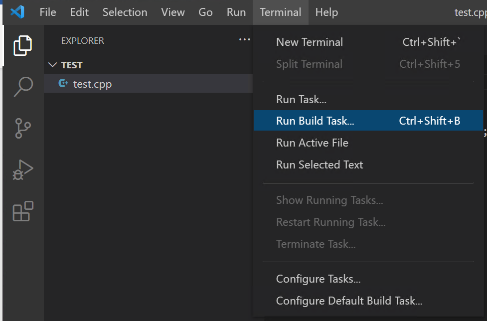
5. 此時上方會出現以下畫面，選擇中間選項使用 **g++** 編譯檔案，如下圖示範：
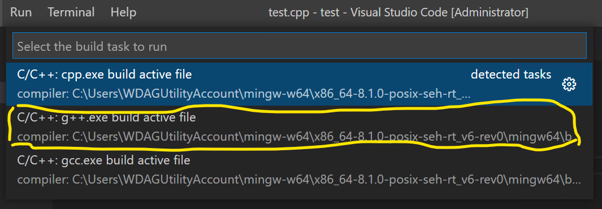
6. 設置正確的話，此時下方會出現編譯成功完成的提示，如下圖示範：
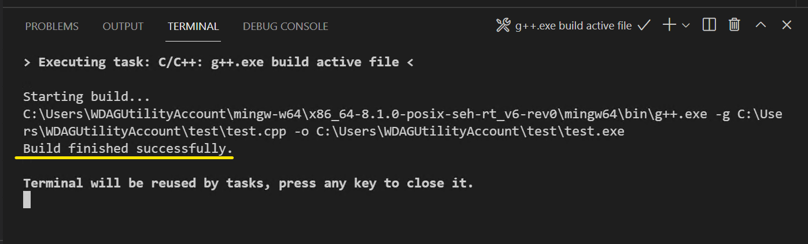

## 測試除錯
1. 完成前項`測試編譯`的所有流程
2. 按下左方三角形按鈕後選擇`Run and Debug`，如下圖示範：
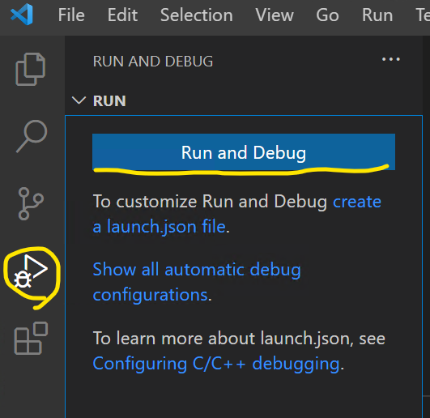
3. 此時上方會依序出現相關提示，選擇預設的即可，如下圖示範：
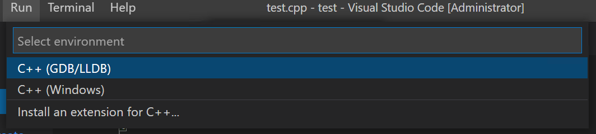
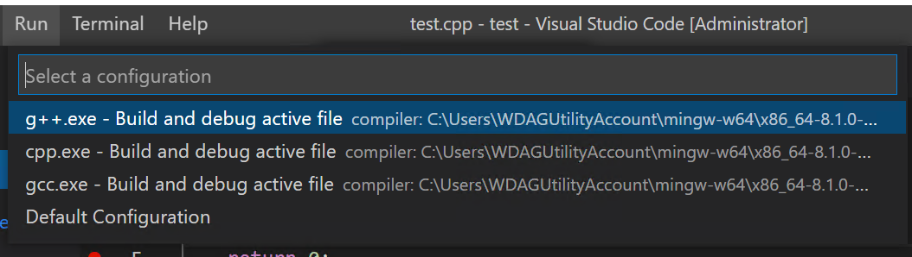
4. 若設定正確的話，會看到程式停留在選取的第5行，如下圖示範：
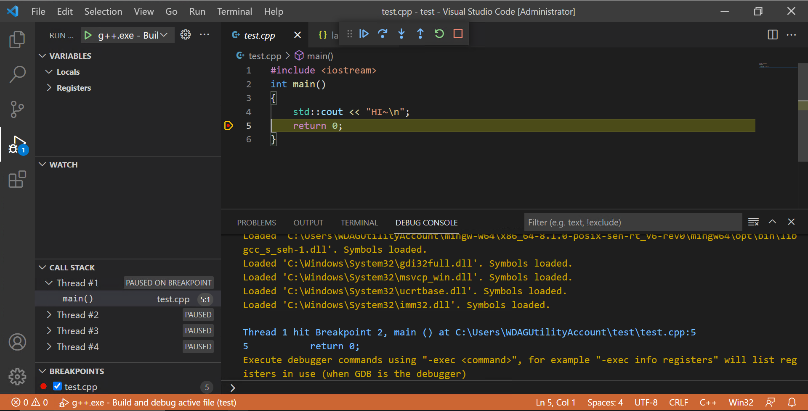

# 製作 `vscode-all-in-one.zip`
1. 到[vscode官方網頁](https://code.visualstudio.com/Download)下載[.zip](https://code.visualstudio.com/sha/download?build=stable&os=win32-x64-archive)後，將檔案解壓縮放置於桌面
2. 開啟`vscode`在`extensions`找到`C/C++`並安裝其套件，之後到路徑`%USERPROFILE%`找到資料夾`.vscode`，將其複製到桌面
3. 到[mingw-w64官方網頁](http://mingw-w64.org/doku.php/download)下載[安裝檔](https://sourceforge.net/projects/mingw-w64/files/Toolchains%20targetting%20Win32/Personal%20Builds/mingw-builds/installer/mingw-w64-install.exe/download)
4. 安裝`mingw-w64`，其中`architecture`選擇`x86_64`後，依照提示完成安裝
5. 找到預設安裝位置`C:\Program Files\mingw-w64\x86_64-8.1.0-posix-seh-rt_v6-rev0`，將其複製到桌面
6. 到[cmake官方網頁](https://cmake.org/download/)下載[.zip](https://github.com/Kitware/CMake/releases/download/v3.21.1/cmake-3.21.1-windows-x86_64.zip)，並解壓縮檔案
7. 將當中`bin/*`底下的檔案複製到`x86_64-8.1.0-posix-seh-rt_v6-rev0\mingw64\bin`，以及將`share/*`底下的檔案複製到`x86_64-8.1.0-posix-seh-rt_v6-rev0\mingw64\share`
8. 在創造一個`test`資料夾並放入`hello_world.cpp`
9. 將所有檔案打包壓縮
